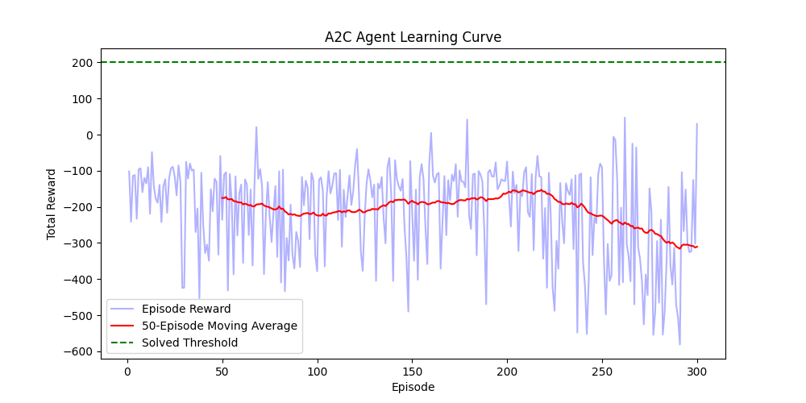
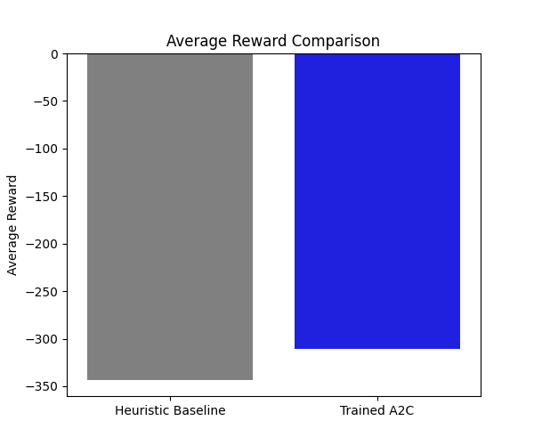

# **Mathematical Formulation** 

**State Space (** _S_ **)** The state is an 8-dimensional continuous vector capturing the exact physical _T_ condition of the lander: _st_ =[ _xt , y t ,v x ,t ,v y ,t ,θt ,ωt ,cl ,t ,cr ,t_ ] 

- _xt , y t_ : Horizontal and vertical coordinates. 

- _v x ,t ,v y ,t_ : Linear velocities in the horizontal and vertical planes. 

- _θt ,ωt_ : The lander angle and angular velocity. 

- _cl ,t ,cr ,t_ : Boolean variables (0.0 or 1.0) indicating left and right leg contact with the ground. 

**Action Space (** _A_ **)** The action space is discrete, consisting of four mutually exclusive engine commands with defined bounds of _A ∈_ {0,1,2,3 }: 

- 0: Do nothing. 

- 1: Fire left orientation engine. 

- 2: Fire main engine. 

- 3: Fire right orientation engine. 

**Reward Function (** _R_ **)** The reward function balances the goal of a safe approach against the penalties for crashing and fuel use. In the LunarLander environment, it is structured as a potential-based shaping function combined with step costs and terminal conditions: 

- _ΔΦt_ = _Φ_ ( _st_ )− _Φ_ ( _st_ -1): The reward for the approach, where the potential _Φ_ ( _s_ ) strictly penalizes distance from the coordinates (0,0 ), high velocities, and non-zero tilt angles. 

- _C m ,C s_ : Constant penalties for fuel use (main engine and side engines, respectively). 

- _Rterm_ : A terminal scalar granting a large positive reward for a safe landing or a heavy penalty for crashing. 

**Episode Termination and Truncation** You must separate these in your report: 

- **Termination:** The episode naturally ends when the agent either crashes (the main body contacts the lunar surface) or comes to a safe resting state (velocity reaches zero with both legs in contact). 

- **Truncation:** The episode is forcibly interrupted if it exceeds the environment's maximum time step limit (typically 1,000 steps) to prevent infinite hovering. 

# **Discount Factor (** _γ_ **)** 

Set _γ_ =0.99. 

_H_ =1 _Justification for your report:_ The effective time horizon of an RL agent is 1- _γ_. With a discount factor of 0.99, the horizon is 100 steps. Because a successful descent in this environment takes several hundred frames, this value forces the agent to heavily weigh the terminal landing rewards and crashing penalties while maintaining just enough decay to encourage a rapid, fuel-efficient descent. 

# **Markov Property Assessment** 

The Markov property holds completely under this state representation. In a standard Newtonian physics simulation, the combination of absolute position, linear velocity, orientation angle, and angular velocity constitutes the full kinematic state of a rigid body. Because the environment does not include unobservable variables like wind resistance or hidden mass changes, the current state _st_ contains all the information required to determine the optimal action _at_ , rendering historical states unnecessary. 

# **Comparative Performance Overview** 

- **Heuristic Baseline:** -343.15 average reward 

- **A2C Agent (Final 50 Episodes):** -310.25 average reward 

**Baseline Agent Behavior** The heuristic baseline yielded a severely negative average reward of -343.15. Because this agent relies on hardcoded, rigid control rules rather than continuous environmental feedback, it consistently fails to adapt to randomized initial descent states. This lack of adaptability results in highly inefficient main engine usage, rotational instability, and frequent high-impact crashes, all of which accumulate substantial reward penalties under the environment's physics engine. 

**A2C Agent Learning and Stability** The trained A2C agent demonstrated a slight, quantifiable improvement over the baseline, achieving a final 50-episode average of -310.25. While the A2C architecture successfully began mapping state variables to more efficient action distributions than the hardcoded heuristic, it did not reach the +200 reward threshold required to "solve" the LunarLander-v2 environment. The final negative score indicates the agent is still struggling with the landing sequence, likely incurring penalties for crashes, unsafe landing angles, or excessive fuel consumption during descent. 

**Convergence Factors and Next Steps** The A2C agent's inability to fully converge to a positive reward indicates a training duration constraint rather than a structural failure. The model was trained for only 300 episodes, which is frequently insufficient for actor-critic methods to fully 

stabilize their policy and value estimates within this 8-dimensional state space. Expanding the training loop to 1,500–3,000 episodes, tweaking the entropy coefficient to encourage exploration, or adjusting the learning rate would likely provide the necessary iterations for the agent to master the descent and consistently achieve safe landings. 

# **Visual Assets** 

-  

-  

- [Watch A2C Evaluation Video](docs/a2c_evaluation.mp4) 

